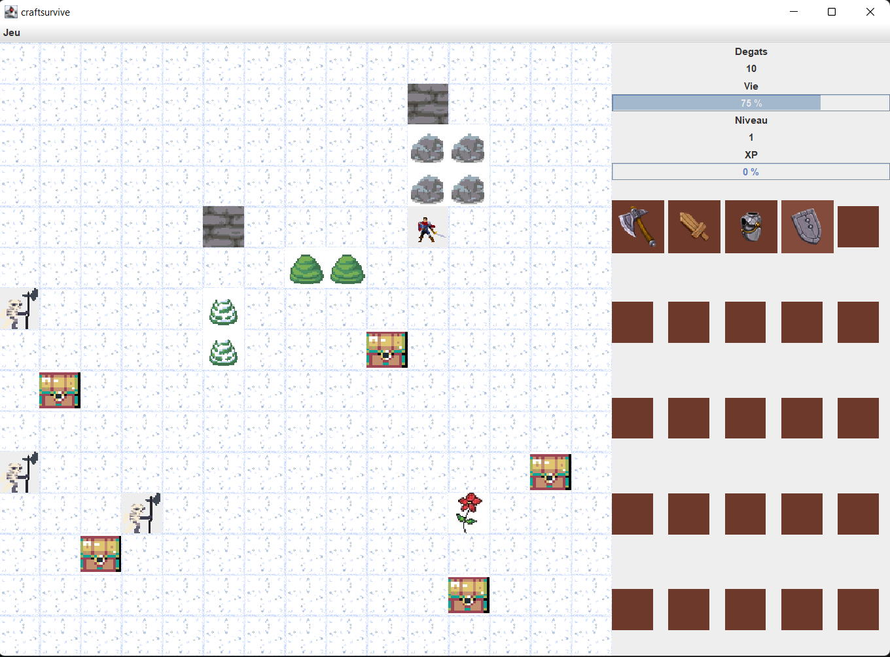

# CraftSurvive  
## INTRODUCTION  
CraftSurvive est un jeu de survie dans lequel un personnage évolue à travers  
différents territoires. L’objectif est de rester en vie malgré les confrontations contre  
des ennemis générés aléatoirement. Il détiendra un inventaire d’armes et d’armures  
pour combattre les ennemis. Il pourra également augmenter de niveau afin d’avoir  
de meilleurs attributs (santé et dégâts). Les ennemis auront des niveaux de  
puissance différente. L’utilisateur pourra sauvegarder puis quitter sa partie à tout  
moment et la reprendre plus tard.  

## COMMANDES  
La classe principales est craftsurvive.java. Le lancement du jeux s’effectue depuis  
l’exécutable CraftSurvive.jar. Il arrive que sous certains  
systèmes d’exploitation (Linux particulièrement) l’affichage ait un problème (seul le  
joueur et les ennemis apparaissent) lorsque l’application est lancé depuis l’archive.  
Pour résoudre le problème il est nécessaire de copier le dossier image présent dans  
le dossier build-jar et de le mettre dans le répertoire ./home/NOM_UTILISATEUR.  
Afin d’exploiter toutes les fonctionnalités du jeu, voici un récapitulatif des  
commandes en jeu :  
- Les touches Z-Q-S-D permettent de déplacer le personnage respectivement
vers le haut, la gauche, le bas, la droite.
- La souris permet de faire les choix dans les menus, pour sauvegarder et
quitter ou démarrer une nouvelle partie
- L’inventaire à droite est interactif, lorsque l’on:
- Clique gauche sur un objet, cela l’équipe ou le déséquipe (petit carré
blanc si équipé)
- Clique droit sur un objet, cela supprime l’objet de l’inventaire.
- La touche A sert à parer les coups des ennemis, de tous les côtés bien sûr il
est impossible d’attaquer et de parer en même temps.
- La touche E sert à attaquer l’ennemi auquel on fait face (selon l’orientation du 
personnage). Elle permet aussi lorsqu’un décor devant nous est cassable de  
le frapper et de la casser lorsqu’on lui a enlevé toute sa vie.  
 
